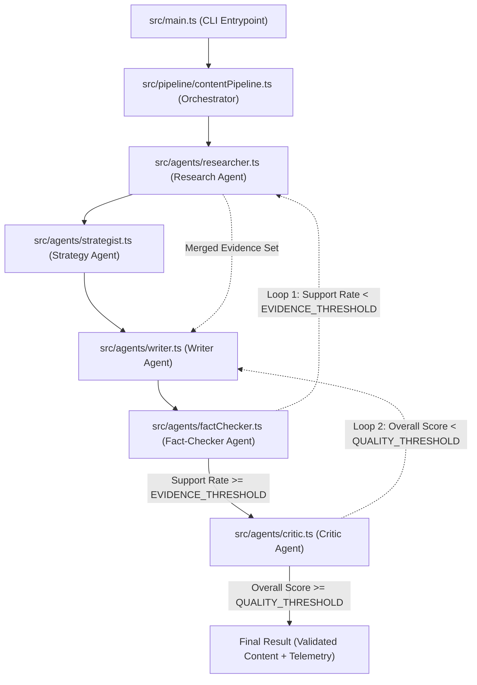
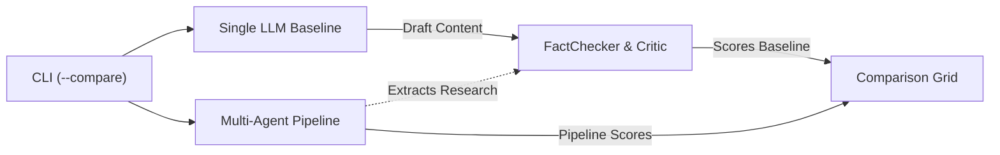

# Content Intelligence Pipeline

An evidence-grounded, multi-agent editorial pipeline implemented in TypeScript using the `@openai/agents` SDK. The system orchestrates specialized autonomous agents to research, outline, draft, fact-check, and critically evaluate platform-specific content through deterministic self-correction feedback loops.

---

## Architectural Overview

Traditional single-prompt LLM generation often suffers from hallucinations, lack of factual verification, and unstructured editorial quality. This pipeline models a distributed editorial workflow with deterministic state machines and typed agent communication boundaries.



---

## Core Capabilities

- **Native Deep Research:** Offloads complex multi-query research and extraction directly to the Tavily Research API, returning structured JSON and completely bypassing LLM token costs during the research phase.
- **Strict Schema Enforcement:** All inter-agent data transfers are typed and validated using `Zod` schemas, preventing cascading format errors.
- **Dual-Loop Self-Correction:**
  - **Loop 1 (Evidence Gap):** Identifies unsupported statements, generates targeted delta search queries, merges newly fetched evidence, and rewrites the content.
  - **Loop 2 (Quality Convergence):** Evaluates drafts across 7 multidimensional vectors; triggers iterative revisions until the quality threshold is met.
- **Real-Time Cost & Token Telemetry:** Granular accounting of prompt tokens, completion tokens, prompt cache hits, latency, and estimated USD expenditure across all agent invocations.
- **Baseline Evaluation Framework:** Built-in benchmarking module to measure multi-agent output against single-call LLM baselines across accuracy, cost, latency, and density.

---

## Agent Specifications

| Agent | Responsibility | Implementation | Primary Output Schema |
| :--- | :--- | :--- | :--- |
| **Researcher** | Gathers verifiable facts, figures, and source URLs based on topic or gap queries | Native Tavily API | `ResearchOutputSchema` |
| **Strategist** | Synthesizes evidence into a structured blueprint (hook, narrative arc, CTA) | OpenAI Agent | `ContentStrategySchema` |
| **Writer** | Generates platform-constrained drafts strictly using verified claims | None | `GeneratedContentSchema` |
| **Fact-Checker** | Deconstructs text into atomic claims and validates against research corpus | None | `FactCheckOutputSchema` |
| **Critic** | Evaluates factual rigor, relevance, density, tone, clarity, and platform fit | None | `CriticOutputSchema` |

---

## Self-Correction Mechanisms

### Loop 1: Evidence Gap Resolution
```
Draft -> Claim Extraction -> Cross-Corpus Verification
  ├─ If Support Rate >= EVIDENCE_THRESHOLD -> Proceed to Critic
  └─ If Support Rate < EVIDENCE_THRESHOLD:
       1. Extract targeted search queries from unsupported claims.
       2. Invoke Researcher with delta query set.
       3. Deduplicate and merge newly acquired evidence.
       4. Invoke Writer in Evidence Rewrite mode.
       5. Repeat verification (bounded by MAX_EVIDENCE_LOOPS).
```

### Loop 2: Quality & Style Convergence
```
Verified Content -> Multidimensional Evaluation
  ├─ If Overall Score >= QUALITY_THRESHOLD -> Finalize Content
  └─ If Overall Score < QUALITY_THRESHOLD:
       1. Compile structured problem statements and recommendations.
       2. Invoke Writer in Revision mode with preserved strengths and corrective notes.
       3. Re-verify factual integrity and re-score with Critic.
       4. Repeat refinement (bounded by MAX_REVISION_LOOPS).
```

---

## Project Structure

```
.
├── src/
│   ├── agents/            # Agent definitions and run handlers
│   │   ├── researcher.ts  # Web research and tool integration
│   │   ├── strategist.ts  # Content angle and outline generator
│   │   ├── writer.ts      # Multi-mode drafting engine
│   │   ├── factChecker.ts # Claim extraction and verification
│   │   └── critic.ts       # Evaluation across 7 scoring vectors
│   ├── evaluation/        # Benchmarking and metrics
│   │   ├── baseline.ts    # Single-call LLM baseline implementation
│   │   └── metrics.ts     # Comparative reporting and analysis
│   ├── pipeline/          # Orchestration core
│   │   └── contentPipeline.ts # Dual-loop execution engine
│   ├── tools/             # External retrieval tools
│   │   ├── searchWeb.ts   # Tavily search wrapper
│   │   ├── fetchPage.ts   # DOM-to-text cleaner and scraper
│   │   └── index.ts       # Tool registry
│   ├── types/             # System-wide schemas and contracts
│   │   └── schemas.ts     # Zod schemas and TypeScript interfaces
│   ├── utils/             # Telemetry, caching, and logging
│   │   ├── cache.ts       # Local research cache
│   │   ├── logger.ts      # Structured terminal logging
│   │   └── tokenTracker.ts# Token usage and pricing tracker
│   └── main.ts            # Application CLI entry point
├── .env.example           # Template for environment configuration
├── package.json           # Dependencies and scripts
├── tsconfig.json          # TypeScript compiler configuration
└── LICENSE                # MIT License
```

---

## Configuration

Copy `.env.example` to `.env` and provide your API credentials:

```bash
cp .env.example .env
```

```ini
# API Keys
OPENAI_API_KEY=your_openai_api_key
TAVILY_API_KEY=your_tavily_api_key

# Models
PRIMARY_MODEL=gpt-4o-mini
EVALUATOR_MODEL=gpt-4o-mini

# Convergence Controls
MAX_EVIDENCE_LOOPS=2
MAX_REVISION_LOOPS=2
EVIDENCE_THRESHOLD=0.5
QUALITY_THRESHOLD=7.0
```

---

## Execution

### 1. Multi-Agent Pipeline Execution (Default)
Executes the full research-to-evaluation pipeline for the configured request:
```bash
npm start
```

### 2. Single-LLM Baseline Execution
Executes an ungrounded, single-call completion control test:
```bash
npm run baseline
```

### 3. Comparative Evaluation Run
Executes both baseline and pipeline consecutively, rendering a side-by-side performance grid and saving experiment telemetry to `/experimental`:
```bash
npm start -- --compare
```

---

## Evaluation Metrics

When running in comparative mode (`--compare`), the system robustly evaluates BOTH the single-LLM Baseline and the Multi-Agent Pipeline through the Fact-Checker and Critic agents, generating a quantitative head-to-head comparison grid on the following vectors:



- **Cost ($ USD):** Exact API expenditure calculated using active model input/output rates.
- **Latency (seconds):** Total wall-clock time from invocation to final output.
- **Word Count:** Length alignment against platform formatting constraints.
- **Fact Support Rate (%):** Percentage of explicit claims backed by cited primary sources. Proves the pipeline's reduction in hallucinations versus the baseline.
- **Quality Score (1-10):** Weighted multi-vector evaluation across factual accuracy, relevance, information density, clarity, originality, platform fit, and audience fit.

---

## License

This project is licensed under the MIT License — see the [LICENSE](LICENSE) file for details.
