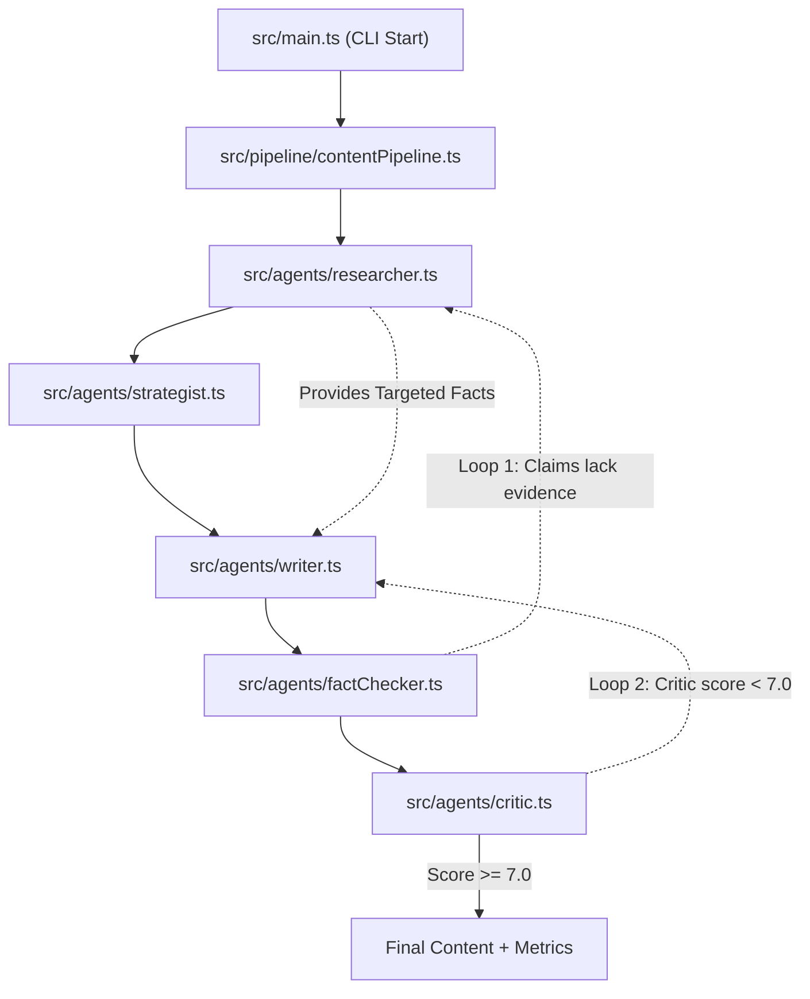

# 🕵️‍♂️ Evidence-Driven Multi-Agent Content Intelligence Pipeline

An advanced, production-ready, agentic social media content generation pipeline built in TypeScript using the official **OpenAI Agents SDK**. 

This system moves beyond standard prompt-engineering and "single-call" LLM wrappers. It simulates a **fully functioning newsroom** with specialized AI agents working together through automated research, strategic outlining, factual verification, and quality-evaluation revision loops.

---

## 🚀 Key Features

* **Grounded in Research:** Uses a Web Search tool (via Tavily) and a Web Scraper to gather real-world, up-to-date evidence *before* writing any content.
* **Dual-Loop Self-Correction Architecture:**
  * **Loop 1 (Evidence Gap):** If the Fact-Checker agent determines that claims lack sufficient evidence, it forces the Researcher to execute targeted queries, then prompts the Writer to fix unsupported claims using the new facts.
  * **Loop 2 (Quality Loop):** If the Critic agent scores the drafted content below a defined quality threshold, it forces the Writer into a revision loop with highly specific critique points.
* **Strict Structured Output:** All agent-to-agent communication is tightly constrained using Zod schemas to ensure stability and prevent cascading hallucinations.
* **Cost & Token Tracker:** Records exact token usage (prompt caching included) and estimates API costs in USD for every pipeline run in real-time.
* **Baseline Comparison Mode:** Empirically proves its own value by running a single-prompt LLM control test and rendering a side-by-side terminal comparison of cost, speed, fact-support rate, and quality.

---

## 🧠 Detailed Agent Workflow (The "Newsroom" Architecture)

The pipeline employs 5 distinct agents. Their interaction is modeled in the Mermaid diagram below:



### The Agents
1. **Researcher Agent:** Equipped with `searchWeb` and `fetchPage` tools. It gathers raw facts, data points, and quotes, attaching confidence and relevance metrics to each.
2. **Strategist Agent:** Analyzes the research and creates a structured content blueprint (Hook, Body, CTA) tailored to the specified platform and audience.
3. **Writer Agent (3 Modes):**
   - *Mode 1 (Drafting):* Writes the initial post strictly adhering to the strategist's outline and researcher's facts.
   - *Mode 2 (Evidence Rewrite):* Fixes specifically targeted unsupported claims using newly gathered facts.
   - *Mode 3 (Revision):* Polishes and refines content based on critic feedback without losing original strengths.
4. **Fact-Checker Agent:** Extracts every claim made by the writer and cross-references it against the accumulated research pool. Yields a "Support Rate %".
5. **Critic Agent:** Evaluates the verified content against 7 distinct vectors (Clarity, Relevance, Info Density, etc.) to produce an overall score out of 10.

---

## ⚙️ Project Setup

### 1. Installation
Clone the repository, navigate to the folder, and install dependencies:
```bash
npm install
```

### 2. Environment Variables
Copy `.env.example` to `.env` and fill in your keys:
```env
OPENAI_API_KEY=your_openai_api_key
TAVILY_API_KEY=your_tavily_api_key
PRIMARY_MODEL=gpt-4o-mini
```

---

## 🛠️ How to Run

* **Run Multi-Agent Pipeline (Default):**
  This runs the full agent workflow using the default topic in `src/main.ts`.
  ```bash
  npm run start
  ```

* **Run Single-LLM Baseline:**
  This runs a basic ChatGPT-style single prompt without any agents to act as a control.
  ```bash
  npm run baseline
  ```
  *(or `npm start -- --baseline`)*

* **Run Both & Compare (Experiment Mode):**
  This runs the baseline first, then the multi-agent pipeline, and prints a side-by-side comparison of cost, speed, and quality.
  ```bash
  npm start -- --compare
  ```

---

## 📚 What I Learned Building This

* **Why Structured Communication Matters:** Forcing agents to return strictly typed JSON (`zod` schemas) prevents cascading errors and hallucinations. If the Fact-Checker returns a boolean, it's explicitly handled in code, not left to LLM interpretation.
* **Feedback Loops in Agents:** Constructing the Evidence Loop and Quality Loop taught me how to handle multi-step, programmatic self-correction in autonomous systems.
* **Scientific Baseline Testing:** Running a control test (the baseline) empirically proves the value of the pipeline. It highlighted that while multi-agent architectures cost slightly more and take longer, they are significantly more factual, robust, and accurate than standard single-prompt LLM wrappers.
* **Cost & Token Constraints:** Designing a custom token tracker taught me the importance of model frugality and prompt-caching awareness when scaling agentic workflows.
